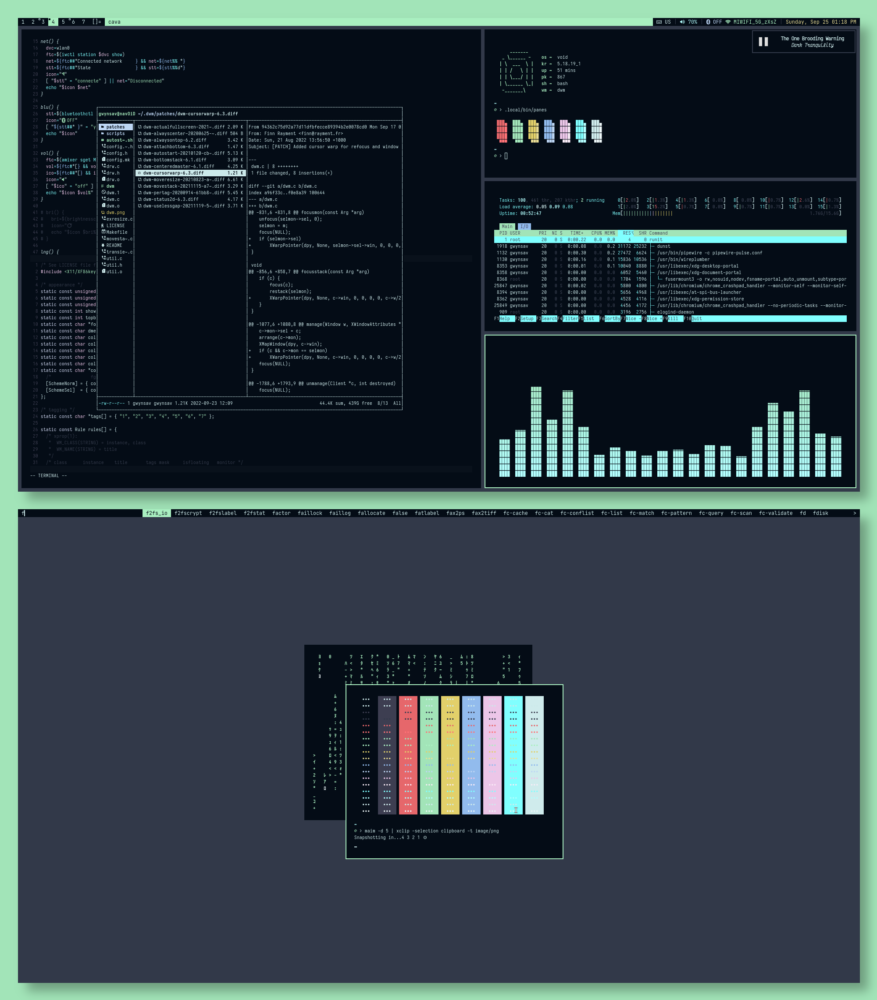
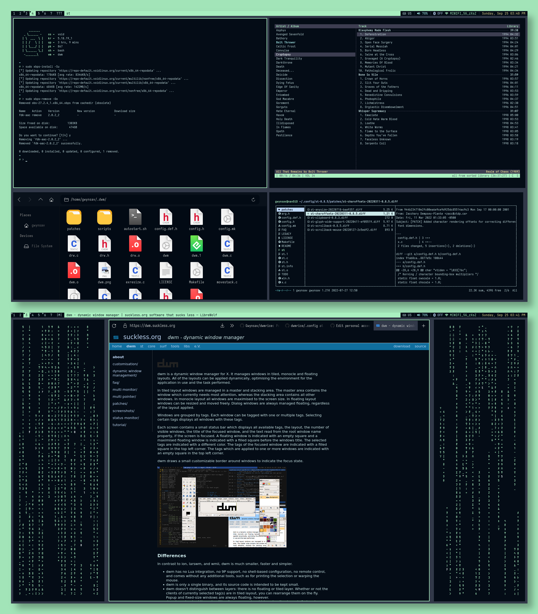

# Welcome


This is my custom build of [dwm](https://dwm.suckless.org/), featuring the [Articblush colorscheme](https://github.com/articblush), and a bunch of patches to improve usability.

Additionally, this repo also includes my [dunst](https://github.com/dunst-project/dunst) and [st](https://st.suckless.org/) setups, just to go with the theme.

# Features
- Media-key bindings for:
  - Volume control.
  - Brightness control.
  - Media playback and volume control.
  - Screenshots using **maim**.
  - Bluetooth power using **bluez-utils**.
  - Keyboard language using **setxkbmap**.
- A complete status bar capable of displaying the information above + battery level, that refreshes every time one of the aforementioned keybinds is used.
- **dmenu** as an application launcher.


### Patches
- **actualfullscreen**, to get a real fullscreen going instead of just hiding the bar and applying monocle.
- **alwayscenter**, to make new floating windows open in the middle of the screen.
- **alwaysontop**, to have the ability to pin floating windows to always be on top.
- **attachbottom**, to make new windows spawn at the bottom of the stack.
- **autostart**, to allow an autorun script to be ran from `~/.dwm/`.
- **cursorwarp**, to make the cursor warp to the middle of the focused window.
- **moveresize**, to allow floating window resizing with the keyboard.
- **movestack**, to allow for moving windows within the stack and in and out of master.
- **pertag**, to prevent the same layout from being applied to every tag on layout change.
- **status2d**, to get colors on the bar.
- **uselessgap**, for the traditional bling.

I have also added the only 2 layouts that I consider to be legitimately useful.
- **bottomstack**, where I removed the horizontal bottom stack layout and just kept vertical stack.
- **centeredmaster**, where I removed the centered floating master layout since it was pretty useless.

# Installation
## Dependencies
- **dwm** has various X dependencies (for Debian and Void, you need the "development" packages):
  - xcb-proto, xcb-util, xcb-util-wm, xcb-util-keysyms, xcb-util-renderutil, xcb-util-image and libxcb. Depending on your distro, the names may vary slightly. 
  - You'll also need **make**, since it's used for compilation.
- **dmenu** as an application launcher.
- **alsa-utils**, **bluez-utils**, **brightnessctl**, **playerctl**, **maim**, and **setxkbmap** for the keybindings and bar.
- **JetBrainsMono Nerd Font**, **FontAwesome** and **Sarasa Mono** for the fonts.
- **dwm** is configured to use my **custom build of st** by default, make sure you install that first if you plan on using it, or change the term in the `.dwm/config.def.h` file before logging into the WM.
## The fun part


```
$ git clone https://github.com/Gwynsav/dwmrice.git
$ cd dwmrice
$ cp -r .dwm/ ../ && cp -r .config/ ../
# cp -r misc/Articblush/ /usr/share/themes/
```
The above commands will copy all relevant files to their corresponding locations. 
Assuming you have already installed all the dependencies:
```
$ cd ~/.config/st-0.8.5/
# rm config.h
# make clean install
$ cd ~/.dwm/
# rm config.h
# make clean install
```
To apply the GTK theme, you should open `~/.config/gtk-3.0/settings.ini` in a text editor and change the following line:
```
[Settings]
gtk-theme-name=Articblush
```

It is also recommended that when you go put `dwm` in your `.xinitrc` file, you do it as:
```
$ while :; do
$   ssh-agent dwm
$ done
```
This will allow you to reload dwm **without having to log out**.
